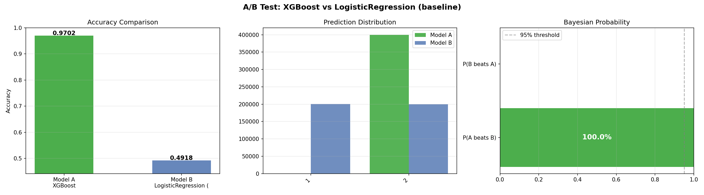

# A/B Test Report

**Winner: `XGBoost`** · Target: `event_type` (classification)

## Statistical Results

| Metric | Model A (XGBoost) | Model B (LogisticRegression (baseline)) |
|--------|---------|---------|
| Accuracy | **0.9702** | 0.4918 |
| Delta | +0.4784 | — |
| McNemar p-value | 0.0000 | ✅ Statistically significant (p < 0.05) |
| P(A beats B) Bayesian | **100.0%** | — |
| N test samples | 400,000 | — |

## Visual Analysis

## AI Interpretation

## A/B Test Interpretation: XGBoost vs. Logistic Regression

**Statistical Winner**

XGBoost (Model A) wins decisively. Across 400,000 test observations, XGBoost achieved an accuracy of **97.02%** compared to Logistic Regression's **49.18%**, a raw delta of **+47.84 percentage points**. The McNemar test p-value is effectively 0.0, and the chi-squared distribution test confirms the same, meaning the probability of this result occurring by chance is vanishingly small. The posterior probability that Model A beats Model B is **1.0** — there is no statistical ambiguity here whatsoever.

**Practical Business Significance**

A 47.84-point accuracy gap on a dataset of 285M user events is not a marginal gain — it is the difference between a functional model and one that is barely better than random guessing on a 3-class problem (view/cart/purchase). Logistic Regression at ~49% accuracy on a 3-class target suggests it is likely defaulting toward the majority class and failing to capture the non-linear behavioral signals that separate browsers from buyers. For an e-commerce platform where recommendation quality directly drives conversion revenue, this gap translates to materially better product targeting, reduced wasted impressions, and higher-value cart predictions. Even a 1–2% lift in purchase prediction accuracy at 285M events scale can represent millions in incremental revenue; a 47-point lift is transformational.

**Recommendation: Deploy Model A Immediately**

Do not run a longer test — the evidence is unambiguous. Deploy XGBoost into production. However, before deployment, validate three things: (1) confirm XGBoost's per-class performance via precision/recall on the **purchase class specifically**, since accuracy alone can mask minority-class failure on an imbalanced target; (2) audit inference latency at production scale to ensure real-time recommendation serving SLAs are met; and (3) monitor for feature drift post-deployment, as behavioral signals like cart and view rates can shift seasonally. The Logistic Regression baseline should be retired entirely.

---
*Generated by Auto Data Scientist v8 — A/B Testing Agent*
