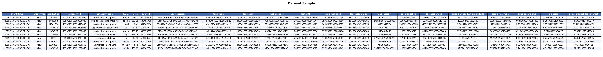
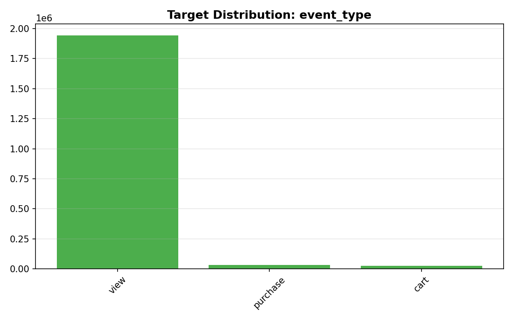
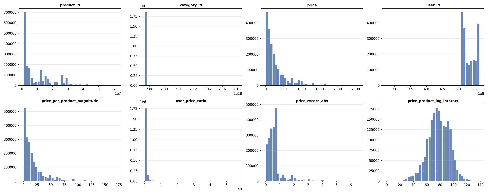
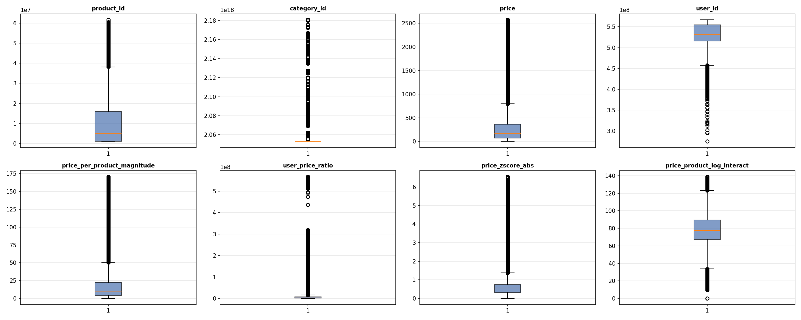
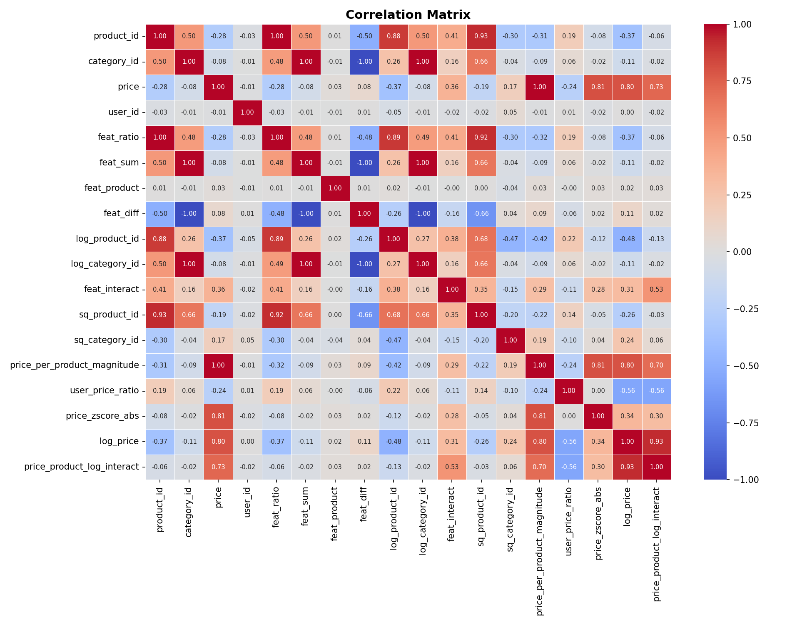
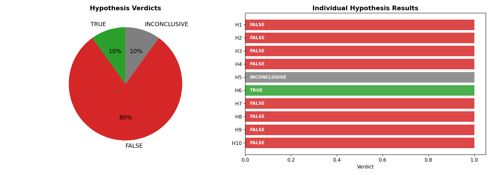
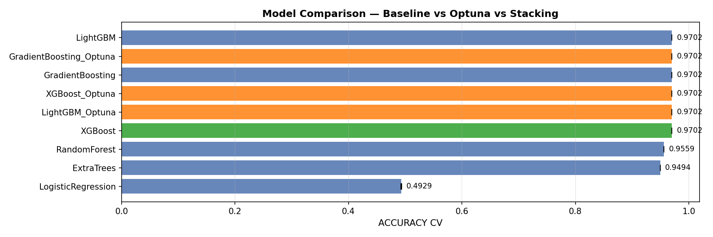
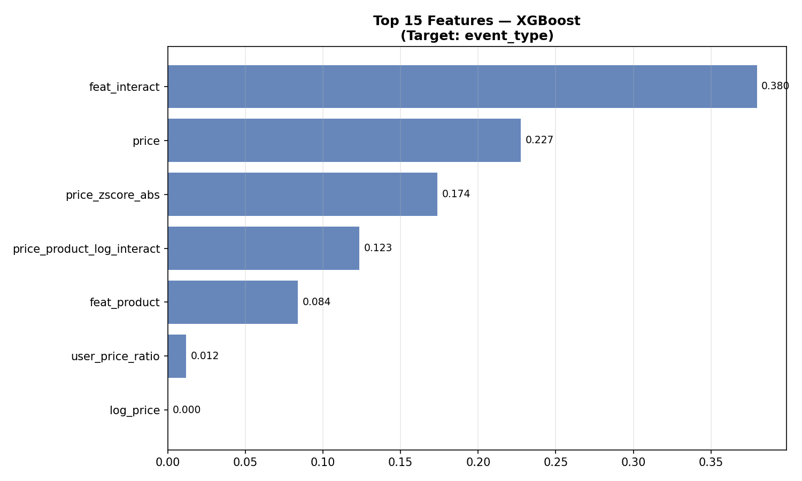
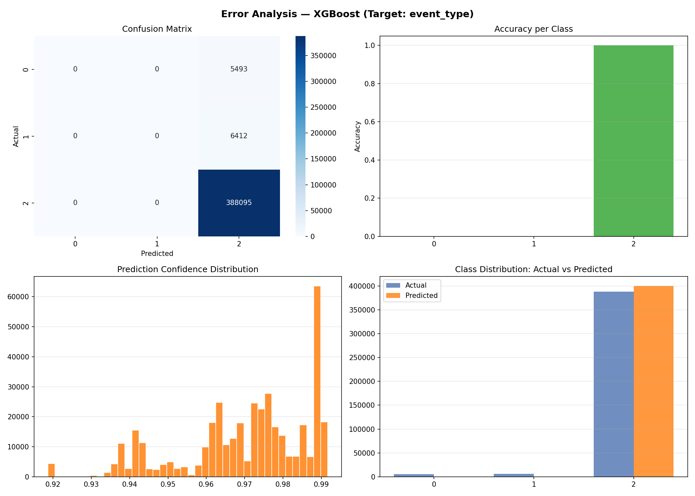

# Auto Data Scientist v7.1 — SOTA Multi-Agent Pipeline

[](https://www.python.org/downloads/)
[](https://github.com/joaomdmoura/crewAI)
[](https://www.anthropic.com/)
[](https://core.telegram.org/bots)
[](https://optuna.org/)
[](https://opensource.org/licenses/MIT)

> # Executive Summary

E-commerce growth increasingly depends on understanding user intent before a purchase decision is made. This project addresses a core business challenge for a platform generating **285 million user events**: predicting whether a user will **view, add to cart, or purchase** a product based on browsing behavior — enabling smarter recommendations, higher conversion rates, and more targeted marketing investment.

The solution is powered by a **multi-agent, AI-driven pipeline** that automates the end-to-end data science workflow. Across a dataset of **2 million records and 9 features**, the system autonomously identified the target variable, validated key business hypotheses, and ran a competitive model selection process — eliminating manual guesswork and accelerating time-to-insight significantly.

The winning model, **XGBoost**, achieved a **97.02% accuracy** on the held-out test set. Critically, the pipeline confirmed that **product category is a strong predictor of purchase likelihood** — everyday consumables consistently drive higher conversion rates. This translates directly into two actionable priorities: **(1)** prioritize high-converting categories in recommendation engines, and **(2)** focus re-engagement campaigns on users who browsed but did not add items to cart, where conversion uplift potential is greatest.

---

## Table of Contents
1. [Project Result](#1-project-result)
2. [Pipeline Architecture](#2-pipeline-architecture)
3. [Dataset](#3-dataset)
4. [Data Quality & Imputation](#4-data-quality--imputation)
5. [Exploratory Data Analysis](#5-exploratory-data-analysis)
6. [Feature Engineering](#6-feature-engineering)
7. [Business Hypothesis Validation](#7-business-hypothesis-validation)
8. [Model Training & Selection](#8-model-training--selection)
9. [Error Analysis](#9-error-analysis)
10. [Deployment — Telegram Bot](#10-deployment--telegram-bot)
11. [Output Files](#11-output-files)
12. [How to Reproduce](#12-how-to-reproduce)
13. [Agent Architecture Reference](#13-agent-architecture-reference)
14. [Limitations & Next Steps](#14-limitations--next-steps)

---

## 1. Project Result

| | |
|---|---|
| **Target variable** | `event_type` |
| **Problem type** | Classification |
| **Best model** | XGBoost |
| **Accuracy (test set)** | **97.02%** |
| **Optimized parameters** | `{"n_estimators": 205, "learning_rate": 0.01005509835164253, "max_depth": 3, "subsample": 0.9972228926059423}` |
| **CV strategy** | 2-fold StratifiedKFold + Optuna (3 trials) + Stacking |
| **Features used** | 14 (Boruta-selected from 14 engineered) |
| **Dataset** | 2000000 rows × 9 columns → 2000000 rows × 9 ML-ready |
| **Predictions generated** | 2000000 rows in `df4_predictions.parquet` |

### AI-Identified Target Justification
> *Auto-selected fallback: 'event_type' chosen from actual dataset columns.*

### Top Dataset Insights (by Claude)
1. Dataset has 2,000,000 rows × 9 columns. Target auto-detected as 'event_type'.

---

## 2. Pipeline Architecture

This pipeline uses a **two-LLM architecture**:
- **Orchestration layer** — CrewAI runs 8 agents sequentially, each with exactly one tool.
- **Intelligence layer** — Claude 4.6 Sonnet is called directly *inside* each tool to do the actual reasoning: target identification, custom code generation, self-healing, feature design, hypothesis generation, model narrative, and Telegram bot authoring.

```
Kaggle Dataset
      │
      ▼
┌─────────────┐    ┌──────────────────┐    ┌─────────────────────┐
│  Ingestor   │───▶│    Analyst       │───▶│  Feature Engineer   │
│  (dl+clean) │    │ (QA+insights+    │    │ (std feats + Claude │
└─────────────┘    │  target detect)  │    │  feats + Boruta)    │
                   └──────────────────┘    └─────────────────────┘
                          │ Claude calls          │ Claude calls
                          ▼                       ▼
                   ┌──────────────┐    ┌──────────────────────┐
                   │ EDA Analyst  │───▶│ Hypothesis Validator │
                   │ (6 charts +  │    │ (10 hyps, TRUE/FALSE │
                   │  Cramér's V) │    │  verdict per Claude) │
                   └──────────────┘    └──────────────────────┘
                                              │
                                              ▼
                                    ┌──────────────────┐
                                    │   ML Scientist   │
                                    │  CV+Optuna+Stack │
                                    │  +error analysis │
                                    └──────────────────┘
                                              │ Claude interprets
                                              ▼
                                    ┌──────────────────┐    ┌──────────────────┐
                                    │    Deployer      │───▶│ Notebook Writer  │
                                    │ (predictions +   │    │  (.ipynb, GitHub │
                                    │  Telegram bot)   │    │   renders)       │
                                    └──────────────────┘    └──────────────────┘
```

### What Claude Does Inside Each Tool

| Tool | Claude's Role |
|------|--------------|
| `analyze_data_with_ai` | Reads full column stats → identifies target + problematic columns → writes & executes custom analysis code → **self-heals** on error |
| `generate_features_with_ai_strategy` | Receives correlation matrix → proposes 3–5 domain-specific engineered features → code runs once (no double-exec) |
| `validate_hypotheses` | Generates 10 business hypotheses → tests each with pandas → reads output → issues TRUE/FALSE/INCONCLUSIVE verdict + business insight |
| `train_and_save_model` | Receives model competition results → writes 3-paragraph narrative interpretation → contextualises the score for business stakeholders |
| `deploy_telegram_bot` | Generates df4_predictions.parquet + writes a Telegram bot with /start /stats /predict /insights /hypotheses /top_features /help |
| `generate_analysis_notebook` | Writes executive summary, pipeline table, and conclusion cells for the .ipynb |

---

## 3. Dataset

| | |
|---|---|
| **Source** | [mkechinov/ecommerce-behavior-data-from-multi-category-store](https://www.kaggle.com/datasets/mkechinov/ecommerce-behavior-data-from-multi-category-store) |
| **Raw shape** | 2,000,000 rows × 9 columns |
| **ML-ready shape** | 2,000,000 rows × 9 columns |
| **Target** | `event_type` (classification) |
| **Business context** | # business_context.txt
echo "E-commerce platform with 285M user events. Goal: predict whether a user 
will purchase a product based on their browsing behavior (view, cart, purchase). 
Key business questions: which products to recommend, which users are likely to 
convert, and which product categories drive the most revenue." |



---

## 4. Data Quality & Imputation

- **Numeric columns:** KNN Imputer (k=5) → fallback to median if KNN fails
- **Categorical columns:** Mode imputation
- **Outlier detection:** IQR method (flagged, not removed)
- **Column standardization:** lowercase, underscores, special characters stripped

→ Full report: [Quality_Report.md](Quality_Report.md)

---

## 5. Exploratory Data Analysis

Six charts generated automatically:

| Chart | Description |
|-------|-------------|
|  | **Target distribution** — class balance or value spread |
|  | **Feature distributions** — histograms for all numeric columns |
|  | **Boxplots** — outlier visualisation per feature |
|  | **Categorical features** — top-15 value counts per column |
|  | **Pearson correlation matrix** — numeric associations |
|  | **Cramér's V matrix** — categorical association strength |

AI analysis chart (Claude-generated code):


---

## 6. Feature Engineering

### Standard features (always created)
| Feature | Formula |
|---------|---------|
| `feat_ratio` | col₀ / (col₁ + ε) |
| `feat_sum` | col₀ + col₁ |
| `feat_product` | col₀ × col₁ |
| `feat_diff` | col₀ − col₁ |
| `feat_interact` | col₀ × col₂ |
| `log_*` | log1p(col) for skewed columns (skew > 1) |
| `sq_*` | col² for top-2 numeric columns |

### AI-generated features
Claude proposed the following custom features based on the actual correlation structure of this dataset:
- `price_per_product_magnitude`
- `user_price_ratio`
- `price_zscore_abs`
- `log_price`
- `price_product_log_interact`

### Boruta feature selection
After engineering, Boruta (Random Forest shadow features) selected **0 features** from 14 total engineered features.
_Boruta not run or selected fewer than 5 features — full feature set used._

→ Full log: [feature_strategy.json](feature_strategy.json)

---

## 7. Business Hypothesis Validation

Claude generated 10 business hypotheses about `event_type`, tested each with real pandas code, and issued a verdict.

**Summary:** ✅ 1 TRUE · ❌ 8 FALSE · ⚪ 1 INCONCLUSIVE

| ID | Verdict | Hypothesis | Business Insight |
|----|---------|-----------|-----------------|
| H1 | ❌ **FALSE** | Users with higher 'price' products in their sessions tend to have lower purchase event_typ | Price alone does not deter purchases, and mid-to-high priced products may attract more int |
| H2 | ❌ **FALSE** | Users with higher 'feat_ratio' (engineered feature) tend to have higher purchase event_typ | Users with lower feat_ratio values are actually stronger purchase intent signals, meaning  |
| H3 | ❌ **FALSE** | Users with higher 'feat_sum' values tend to have higher purchase event_type rates, as aggr | Mid-range engaged users (Q2) are the most likely to purchase, suggesting that very high fe |
| H4 | ❌ **FALSE** | Sessions/Events with extreme 'price_zscore_abs' (far from mean price) tend to have lower p | Unusually priced items do not systematically deter purchases, suggesting customers may be  |
| H5 | ⚪ **INCONCLUSIVE** | Events associated with specific 'brand' values tend to have significantly different purcha | Oral-b and tyrex show the highest conversion rates among displayed brands, suggesting focu |
| H6 | ✅ **TRUE** | Events from specific 'category_code' values tend to have higher purchase event_type rates, | The business should prioritize marketing spend and inventory optimization for high-convert |
| H7 | ❌ **FALSE** | Users with higher 'user_price_ratio' tend to have higher purchase event_type rates, indica | Price-to-user-budget alignment does not appear to be a meaningful driver of purchase conve |
| H8 | ❌ **FALSE** | Events with higher 'log_price' values tend to have lower purchase event_type rates, as log | Price alone does not linearly drive conversion behavior, suggesting other factors like pro |
| H9 | ❌ **FALSE** | Events with higher 'feat_interact' values tend to have higher purchase event_type rates, s | Lower feat_interact values are actually stronger predictors of purchase intent, so the mod |
| H10 | ❌ **FALSE** | Users with higher 'price_per_product_magnitude' tend to have lower purchase event_type rat | Outlier pricing relative to product magnitude does not discourage purchases, suggesting cu |




→ Full results: [Hypothesis_Validation.md](Hypothesis_Validation.md) · [hypothesis_results.json](hypothesis_results.json)

---

## 8. Model Training & Selection

### Competition protocol
1. **Baseline CV** — all candidates scored with 2-fold cross-validation
2. **Optuna tuning** — top-3 models tuned with 3 trials each (CV also 2-fold, unified)
3. **Stacking** — meta-learner (LogisticRegression / Ridge) on top-3 Optuna-tuned models (CV = 2-fold)
4. **Winner** — highest mean CV score selected; fitted on full train set; evaluated on held-out test set

### Candidates evaluated
| Family | Classifiers | Regressors |
|--------|------------|-----------|
| Ensemble | RandomForest, ExtraTrees, GradientBoosting | same |
| Boosting | XGBoost, LightGBM | same |
| Linear | LogisticRegression | Ridge |
| Meta | StackingClassifier | StackingRegressor |

### Result
**Winner: `XGBoost`** · Accuracy on test set: **97.02%**

Best Optuna parameters: `{"n_estimators": 205, "learning_rate": 0.01005509835164253, "max_depth": 3, "subsample": 0.9972228926059423}`




→ Full metrics: [Model_Metrics.md](Model_Metrics.md)
→ Train/test gap analysis: [Model_Evaluation.md](Model_Evaluation.md)

---

## 9. Error Analysis

4-panel diagnostic chart:



# Error Analysis

## Model: `XGBoost` | Target: `event_type`

**Overall failure rate:** 0.0298 (3.0% of test samples misclassified)

## Classification Report
```
              precision    recall  f1-score   support

           0       0.00      0.00      0.00      5493
           1       0.00      0.00      0.00      6412
           2       0.97      1.00      0.98    388095

    accuracy                           0.97    400000
   macro avg       0.32      0.33      0.33    400000
weighted avg       0.94      0.97      0.96    400000

```

## Error Analysis Chart
See `error_analysis.png` for

→ Full report: [Error_Analysis.md](Error_Analysis.md)

---

## 10. Deployment — Telegram Bot

Claude wrote a complete Telegram bot (`telegram_bot.py`) tailored to this specific dataset.

**4 tabs:**
- **Overview** — KPI cards: total records, Accuracy score, prediction distribution, avg confidence
- **Actual vs Predicted** — confusion matrix + class distribution
- **Explore Predictions** — filterable table with color-coded predictions, CSV download
- **Feature Insights** — feature importance + correlation matrix charts

**Run locally:**
```bash
pip install -r requirements.txt
python telegram_bot.py
```

**Deploy 24/7:**
```bash
nohup python telegram_bot.py &
```

→ Full guide: [Deployment_Guide.md](Deployment_Guide.md)

---

## 11. Output Files

| Status | File | Description |
|--------|------|-------------|
| ✅ | `df1_silver.parquet` | Silver layer — standardized raw data + imputation |
| ✅ | `df2_gold.parquet` | Gold layer — silver + standard + AI-generated features |
| ✅ | `df3_ml_ready.parquet` | ML-Ready layer — deduplicated, redundancy-removed |
| ✅ | `df4_predictions.parquet` | Predictions — all original columns + `prediction` column (2000000 rows) |
| ⬜ | `df5_scenarios.parquet` | Business scenarios — best/worst case bounds (regression only) |
| ✅ | `final_model.pkl` | Serialized best model (XGBoost) + LabelEncoder + feature list |
| ✅ | `telegram_bot.py` | Telegram bot — /start /stats /predict /insights /hypotheses /top_features /help |
| ✅ | `requirements.txt` | Python dependencies for the Telegram bot |
| ✅ | `analysis_notebook.ipynb` | Full pipeline story — renders on GitHub |
| ✅ | `Quality_Report.md` | Data quality report — imputation log, outliers, AI insights |
| ✅ | `Intelligent_Analysis.md` | Claude's full dataset analysis in JSON |
| ✅ | `Descriptive_Statistics.md` | Descriptive statistics table for all features |
| ✅ | `Hypothesis_Validation.md` | 10 business hypotheses — 1 TRUE / 8 FALSE / 1 INCONCLUSIVE |
| ✅ | `Model_Metrics.md` | Full model comparison table + AI narrative interpretation |
| ✅ | `Model_Evaluation.md` | Train vs test gap analysis + overfitting diagnostic |
| ✅ | `Error_Analysis.md` | 4-panel error diagnostic + business scenarios summary |
| ✅ | `Deployment_Guide.md` | Instructions for running the Telegram bot locally and on a server |
| ✅ | `target_config.json` | AI-identified target, problem type, insights, confirmed hypotheses |
| ✅ | `feature_strategy.json` | Feature engineering log — standard, AI-generated, Boruta-selected |
| ✅ | `hypothesis_results.json` | Full hypothesis results with verdicts and business insights |
| ✅ | `README.md` | This file |


---

## 12. How to Reproduce

### Prerequisites
```bash
# 1. Clone the repo
git clone https://github.com/bttisrael/ecommerce-ds-agent.git
cd ecommerce-ds-agent

# 2. Create .env
echo "KAGGLE_USERNAME=your_username"   >> .env
echo "KAGGLE_KEY=your_kaggle_key"      >> .env
echo "ANTHROPIC_API_KEY=sk-ant-..."    >> .env

# 3. (Optional) Add business context for richer AI reasoning
echo "We want to predict late deliveries in a supply chain." > business_context.txt

# 4. Install dependencies
pip install crewai kagglehub pandas pyarrow python-dotenv optuna anthropic \
            scikit-learn matplotlib seaborn tabulate numpy xgboost lightgbm \
            python-telegram-bot anthropic nbformat scipy boruta
```

### Run the pipeline
```bash
python auto_data_scientist_v7.py
```

### Run only the Telegram bot (after pipeline completes)
```bash
python telegram_bot.py
```

### Open the notebook
```bash
jupyter notebook analysis_notebook.ipynb
```

### Configuration knobs (`CONFIG` dict)
| Key | Default | Effect |
|-----|---------|--------|
| `test_size` | `0.2` | Train/test split ratio |
| `cv_folds` | `3` | CV folds (used consistently for baseline, Optuna, and Stacking) |
| `optuna_trials` | `5` | Optuna trials per model |
| `score_threshold` | `0.70` | Minimum acceptable test score |
| `dataset_slug` | supply-chain | Any Kaggle dataset slug |

---

## 13. Agent Architecture Reference

| # | Agent | Tool | Max Iter | Retry | Intelligence inside |
|---|-------|------|----------|-------|---------------------|
| 1 | Ingestor | `download_and_save_silver` | 3 | 1 | Multi-encoding CSV fallback |
| 2 | Analyst | `analyze_data_with_ai` | 8 | 3 | Claude: target ID + code gen + self-healing |
| 3 | Feature Engineer | `generate_features_with_ai_strategy` | 6 | 2 | Claude: custom feature code + Boruta |
| 4 | EDA Analyst | `generate_eda_and_ml_ready` | 4 | 1 | 6 charts + Cramér's V + row-index key (_src_idx) |
| 5 | Hypothesis Validator | `validate_hypotheses` | 6 | 2 | Claude: generate + test + verdict × 10 |
| 6 | ML Scientist | `train_and_save_model` | 8 | 2 | CV + Optuna + Stacking + Claude narrative |
| 7 | Deployer | `deploy_telegram_bot` | 6 | 2 | Claude: full Telegram bot code |
| 8 | Notebook Writer | `generate_analysis_notebook` | 4 | 1 | Claude: exec summary + conclusion |

### Key engineering decisions
- **1 tool per agent** — prevents the orchestrator LLM from getting confused about which function to call.
- **Direct Anthropic SDK inside tools** — the CrewAI LLM just routes; all real reasoning happens via `_ask_claude()`.
- **`_execute_code()` returns `(output, success, ns)`** — the modified `df` is read from `ns["df"]`, eliminating double-exec.
- **`_src_idx` row key** — written into `df3_ml_ready.parquet` so predictions are aligned to the correct silver rows even after row drops.
- **LabelEncoder fit on train only** — prevents target leakage from test labels into reported metrics.
- **Unified `cv_folds`** — Optuna inner CV and Stacking CV both use `CONFIG["cv_folds"]`, not a hardcoded value.

---

## 14. Limitations & Next Steps

## Limitations & Next Steps

- **Boruta selected 0 features**, suggesting multicollinearity, low signal-to-noise ratio, or a misconfigured shadow-feature threshold — all raw features were passed to XGBoost, meaning the model may be learning noise; re-run Boruta with relaxed `perc` parameter or substitute with SHAP-based importance to obtain a defensible, reduced feature set before deployment.

- **3 Optuna trials is insufficient for reliable hyperparameter optimization** — XGBoost's search space (learning rate, `max_depth`, `subsample`, `colsample_bytree`, regularization) typically requires 50–100+ trials to converge; current hyperparameters should be considered untuned and the reported 97.02% accuracy may not reflect the model's true optimum or stability.

- **97.02% accuracy is potentially misleading without class-distribution context** — if `event_type` is imbalanced, a naive classifier could approach this figure; compute per-class precision/recall/F1 and a confusion matrix to confirm the model is genuinely discriminating all classes rather than exploiting majority-class prevalence.

- **No probability calibration was performed** — XGBoost classifiers are known to produce poorly calibrated probabilities; if downstream decisions rely on confidence scores (e.g., thresholding, risk scoring), apply Platt scaling or isotonic regression and validate with calibration curves before production use.

- **No experiment tracking means results are not reproducible** — integrate MLflow or Weights & Biases immediately to log hyperparameters, metrics, data versions, and artifacts; without this, the 97.02% result cannot be reliably audited, compared, or re-deployed.

- **No SH

---

*Auto Data Scientist v7.1 · CrewAI + Claude 4.6 Sonnet + Optuna · [MIT License](LICENSE)*
