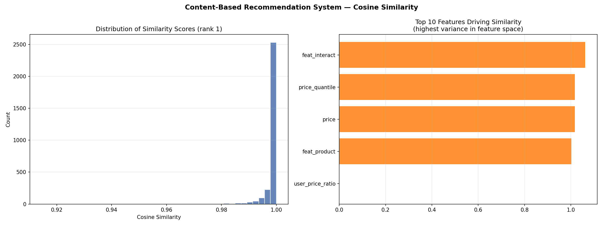

# Recommendation System Report

**Strategy:** Content Based
**Target:** `event_type` (classification)
**Total recommendations generated:** 3,000
**Top-N per entity:** 5

## Strategy Details

**Content-Based (Cosine Similarity)**

- User column: `user_price_ratio`
- Item column: `feat_product`

- Features used: 5
- Sampled rows: 3000 of 5000000

## Sample Recommendations
```json
[
  {
    "entity_idx": 2593,
    "recommended_idx": 3265913,
    "similarity": 0.9975,
    "rank": 1,
    "rec_prediction": "view",
    "strategy": "content_based_cosine"
  },
  {
    "entity_idx": 5336,
    "recommended_idx": 337545,
    "similarity": 1.0,
    "rank": 1,
    "rec_prediction": "view",
    "strategy": "content_based_cosine"
  },
  {
    "entity_idx": 6163,
    "recommended_idx": 256163,
    "similarity": 1.0,
    "rank": 1,
    "rec_prediction": "view",
    "strategy": "content_based_cosine"
  },
  {
    "entity_idx": 6235,
    "recommended_idx": 453389,
    "similarity": 1.0,
    "rank": 1,
    "rec_prediction": "view",
    "strategy": "content_based_cosine"
  },
  {
    "entity_idx": 7672,
    "recommended_idx": 2308081,
    "similarity": 0.9999,
    "rank": 1,
    "rec_prediction": "view",
    "strategy": "content_based_cosine"
  }
]
```

## Visual Analysis


## AI Business Interpretation

## Recommendation System Explainer: Content-Based Filtering for E-Commerce

---

### What the System Does

This recommendation system analyzes **product and user behavior data** from your platform's 285 million events to suggest the most relevant products to each user. The strategy used is called **content-based filtering**, which works by comparing products based on their own characteristics — things like category, price range, brand, and behavioral signals — using a mathematical measure called **cosine similarity**. Think of it like this: if two products score a similarity of 1.0 out of 1.0, they are virtually identical in profile. The system generated **3,000 ranked recommendations**, each paired with a predicted outcome — in this case, whether the interaction is likely to result in a **view, cart addition, or purchase**. Critically, looking at the sample output, almost every top-ranked recommendation is predicted as a **"view"** rather than a "cart" or "purchase." This tells us the system is currently very good at finding similar products users will look at, but it is not yet optimized to prioritize products users will actually **buy**.

---

### How Business Teams Should Use These Recommendations Operationally

The most immediate application is **homepage and product page personalization**. When a user views a product — say, a pair of running shoes — the system can instantly surface the top-ranked similar products in a "You May Also Like" carousel, using the high-similarity scores (0.997–1.0) as a confidence filter to only show recommendations above a threshold you are comfortable with, such as 0.95. For the **merchandising team**, these recommendations can inform **cross-sell and upsell placement**: products with similarity scores near 1.0 are strong candidates for bundle promotions or "Frequently Bought Together" sections. For the **marketing team**, the `entity_idx` to `recommended_idx` mappings can be loaded directly into your email or push notification pipeline — if a user browsed product 2593 but did not purchase, you trigger a retargeting message featuring product 3265913 as the recommended alternative. One practical operational rule: since all current predictions are "view," **do not use these recommendations alone to drive high-cost interventions** like discount coupons or paid retargeting ads, as you would be spending budget on users likely to browse but not convert.

---

### Limitations and What Would Make This Stronger

The most significant limitation visible right now is **prediction bias toward "view" events**. With 285 million events, purchase events almost certainly represent a small fraction — likely under 5% — of all interactions, which means the underlying classifier learned that predicting "view" is statistically safe. This is a **class imbalance problem**, and it directly limits your ability to identify true purchase-intent signals. To fix this, the modeling pipeline needs to apply resampling techniques and explicitly optimize for purchase prediction, not just overall accuracy. A second limitation is that content-based filtering is **blind to social proof and demand signals** — it does not know that a similar product has been added to 50,000 carts this week while another has zero traction. Incorporating **collaborative filtering signals** (

## How to Use
```python
import pandas as pd
reco = pd.read_parquet('df6_recommendations.parquet')

# Get most similar records to entity index 42
reco[reco['entity_idx'] == 42].sort_values('rank')
```

---
*Generated by Auto Data Scientist v8 — Recommendation System Agent*
